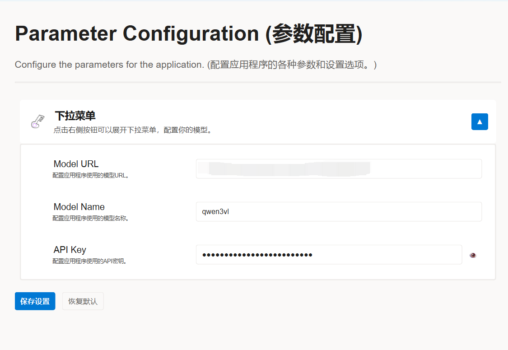

# Instant-Search
Instant Search，通过截图快速获取信息。当你在刷短视频时看到一个电影片段，是否想知道它是哪部电影？当朋友分享一张名人照片但你不认识他们时，是否想立即知道是谁？通过这个程序，你可以使用快捷键截图，即时获取屏幕上的信息。无论是识别图片、理解代码行，还是翻译信息，即时搜索都能为你提供快速参考，并推荐相关网站帮助你深入了解。

# 使用步骤
简单易用

- 配置你的参数（LLM URL；模型名称（建议使用多模态模型）；API密钥）；
    
- 按下 "Ctrl+Alt+A" 选择截图区域；
    
- 输入你想从截图中获取的信息；
    
- 按下 "Enter" 键。
    
# 安装
- 从 GitHub 下载项目。
- 安装所需的依赖项。
    ```bash
    pip install -r requirements.txt
    ```
- 运行项目。
    ```bash
    python main.py
    ```

# 愿景
随着技术的发展，人们与事物互动的方式需要重新思考。在这里，我们想摆脱传统的在搜索框输入文字的搜索方式，探索新的搜索方式（结合2D图像信息）。

# 后续计划
- 改进用户界面
- 添加更多功能
- 优化性能
- 增强安全性
- 添加云端功能
- 开发手机和平板电脑应用

# 联系方式
如果您从我的想法中获得了灵感，我希望您能提到我。任何建议和反馈都欢迎。您可以通过以下邮箱联系到我：pangjiahuan@sjtu.edu.cn或者是pangjiah@foxmail.com。QQ群：784841771。谢谢！

